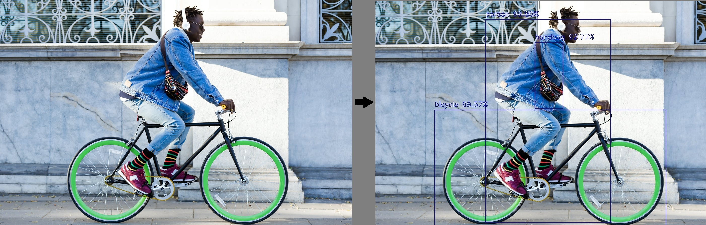
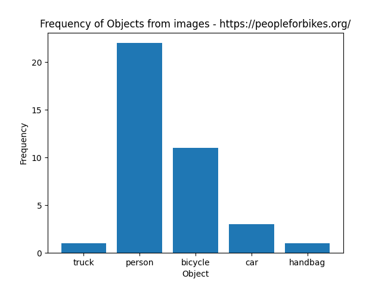
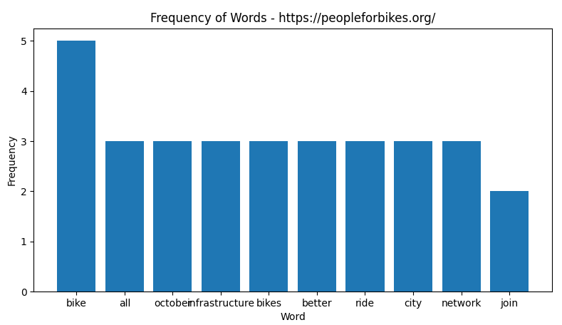
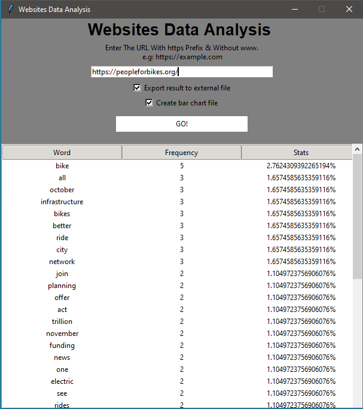

# WebDataAnalysis
# Computer Vision & Data Analysis - Website Data Analysis
## (20 years old) Almog Ben-Shaul
## April 2018

#### Using computer vision model on website images and process the source page to predict the website main subject (e.g for safe purchase)
#### Implemented in Python using:
- Tensorflow and Imageai for object detection
- BeautifulSoup, urllib, regular expression and matplotlib for gethering the data, clean and display it
- tkinter for User-interface

#### Image Processing and object detection:
extracting all images from the site using BeautifulSoup and urlib, and pass them to the model (yolov3) by Imageai and Tensorflow:

(pictures taken from peopleforbikes.org)  

After counting the number of appearance for every object the model detect, the first plot can be displayed:
  
(in this exemple, based on this data, one can assume the main subject of the site is either bikes or persons, taken from peopleforbikes.org)  

#### Processing Data from the website Source-page:
extracting the source-page of the website using BeautifulSoup and urlib.  
from the source-page, extracting only plain text using regular expression, then cleaning the data by removing words like html syntax, english prepositions etc.
  
(in this exemple, based on this data and the data from the object detection model, we can predict with high accuracy, the main subject of the site ,taken from peopleforbikes.org)  
